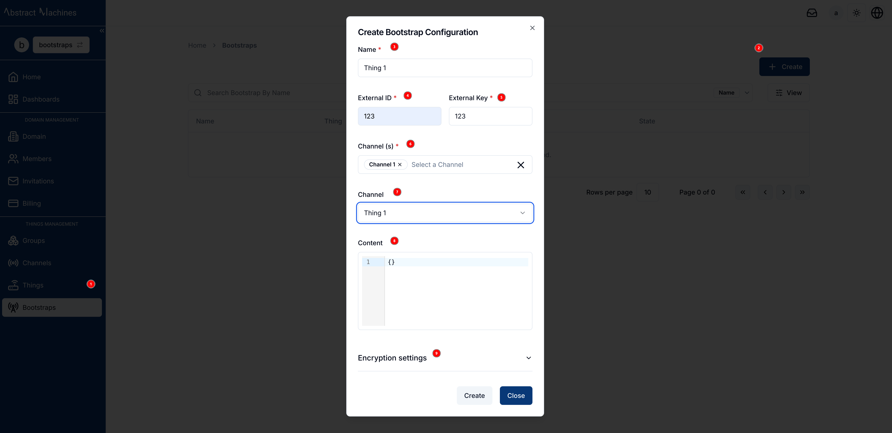
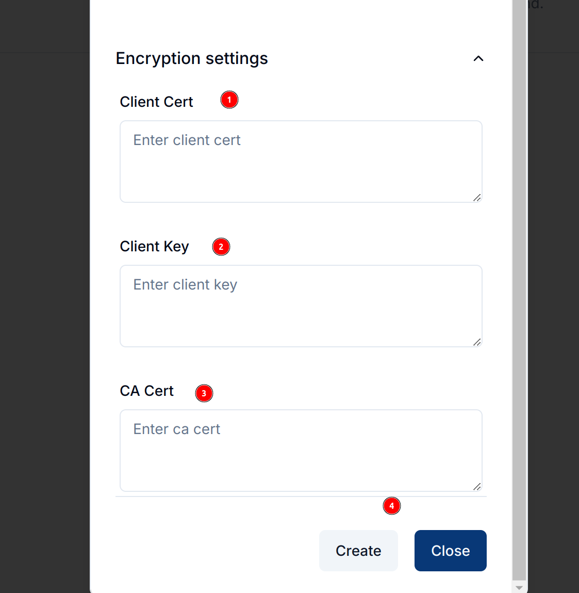
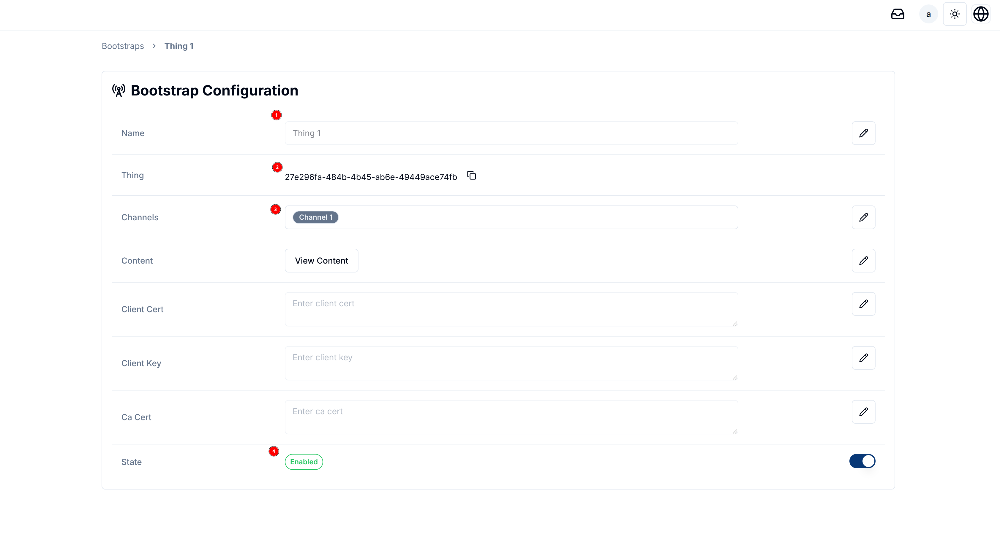
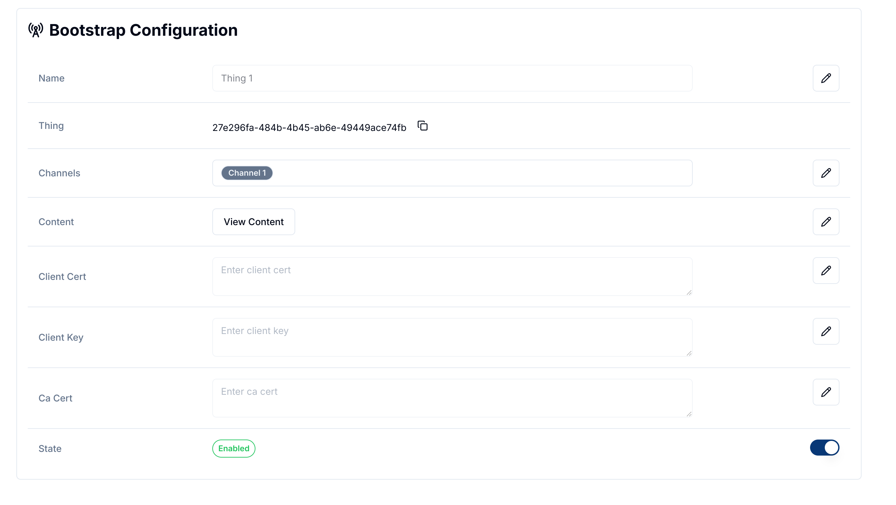
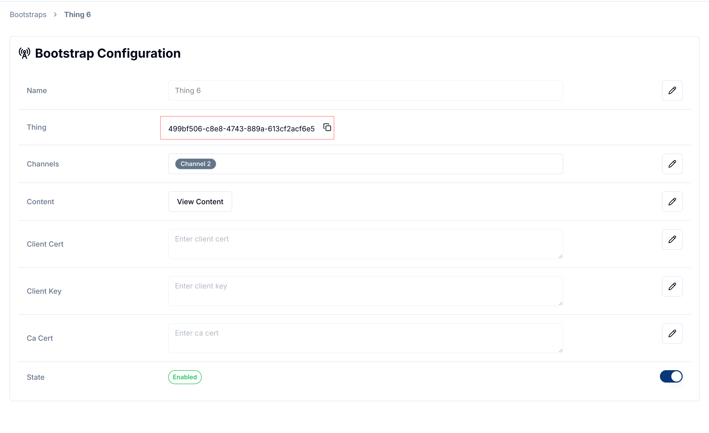
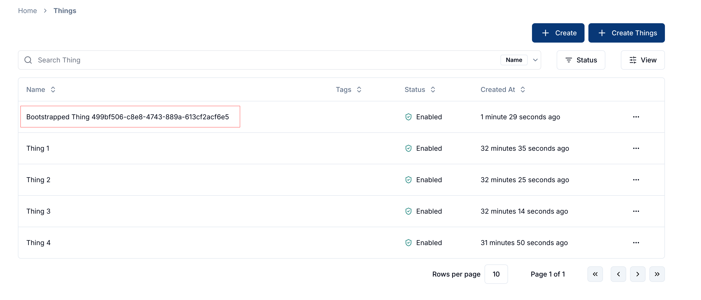

Bootstrapping is the process of automatically configuring a device to connect with the Magistrala platform without external input.
It is essential when devices need to establish or update their configuration due to various reasons such as failure to connect with Magistrala services or a need to refresh device credentials.
Magistrala supports this self-starting bootstrapping process, but certain prerequisites must be met before the process can proceed.

## How Bootstrapping Works

A device can initiate a bootstrap when:

- It only has bootstrap credentials and lacks Magistrala credentials.
- It encounters issues connecting to Magistrala services (e.g., server not responding or authentication failure).
- It requires an update or refresh of its configuration.

> **Note**: Bootstrapping and provisioning are distinct processes. Provisioning manages entities, while bootstrapping deals with configuring entities.

### Configuration Details

The configuration of a Magistrala device (referred to as a "thing") consists of three main components:

1. **Channels**: A list of Magistrala channels to which the device is connected. These channels must be pre-provisioned.
2. **Custom Configuration**: Specific parameters that set up the device or can be left empty if no extra setup is required.
3. **Thing Secret and Certificate Data**: Security information related to the device (such as client certificates and CA certificates).

Additionally, the configuration includes an **external ID** and an **external key**, both of which are crucial for authenticating the device during the bootstrap process.

### Creating a Bootstrap Configuration

To create a bootstrap configuration via the UI:

1. **Access the Bootstraps Section**:
   - Navigate to the **Bootstraps** option in the **Things Management** panel.
   - Click on the **+ Create** button to open the **Create Bootstrap Configuration** dialog.

    

2. **Enter Configuration Details**:
   - **Name**: Enter a human-readable name for the bootstrap configuration.
   - **External ID**: Provide a unique identifier for the device (e.g., MAC address or serial number).
   - **External Key**: Enter a secret key securely stored on the device, used for authentication during the bootstrap process.
   - **Channel(s)**: Select the channels to which the device will connect. These must be provisioned before setting up the configuration.
   - **Thing**: Optionally, choose an existing thing or leave this field empty. If left empty, a new thing will be created with the configuration ID.

    

3. **Encryption Settings**:
   - Expand the **Encryption Settings** section to enter optional encryption credentials.
     - **Client Cert**: Enter the PEM or base64-encoded DER client certificate.
     - **Client Key**: Provide the client certificate key.
     - **CA Cert**: Input the trusted CA certificate.
   - These fields are optional but may be necessary if the device needs to establish a TLS-encrypted connection during bootstrapping.

    

4. **Submit the Configuration**:
   - Click the **Create** button to save the bootstrap configuration.
   - A newly created bootstrap configuration will appear in the list as **Disabled** by default. You must manually enable it to activate the bootstrap process.

    

### Viewing and Managing Bootstrap Configurations

1. **Bootstrap Configuration Details**:
   - Click on any configuration in the list to view its details.
   - The configuration will show all fields, including the name, thing ID, channels, and state (enabled or disabled). It will also provide options to view and edit the custom content and encryption settings.

   

2. **Automatically Generated Things**:
   - If a bootstrap configuration is created without specifying a thing, a new thing will be automatically generated using the configuration ID. This can be seen in the **Things** section.
   - The new thing will appear in the things list with its status set to **Enabled**.

   

    

### Fields Overview

1. **External ID**: An identifier corresponding to the device (e.g., MAC address or serial number). It is used during the bootstrapping process to identify the device.
2. **External Key**: A secret key stored securely on the device, different from the Magistrala key. It is used to authenticate the device during bootstrapping.
3. **Channels**: List of pre-provisioned channels the device connects to. These must be set up before uploading the configuration.
4. **Content**: Custom parameters that configure the device. It can be empty if no additional setup is needed.
5. **Encryption Settings**: Includes fields for client certificates and CA certificates, necessary for secure bootstrapping using TLS.

### Enabling and Managing Bootstraps

- After creating a bootstrap configuration, you can enable or disable it. Enabling the configuration allows the device to start the bootstrapping process.
- You can edit or delete the configuration using the icons next to each field. Changes can include updating channels, modifying encryption settings, or editing custom content.

### Summary

The Magistrala Bootstrap service facilitates secure and automated configuration of devices, enabling them to connect with the platform based on predefined credentials.
By managing and configuring bootstrap settings in the UI, users can streamline the process, ensuring devices are set up and authenticated efficiently.
Make sure to provision channels and set up the necessary security credentials to facilitate a smooth bootstrap process.
