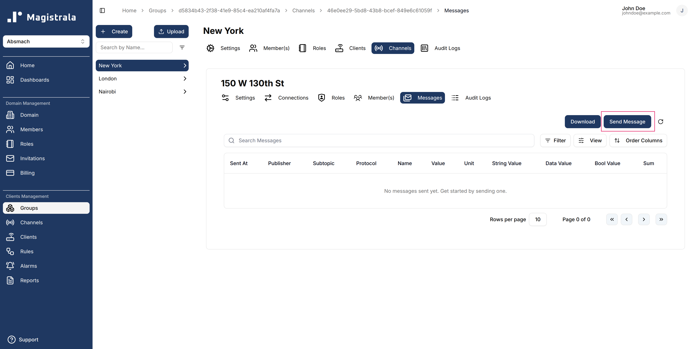

Channels are considered as message conduits.

They are responsible for the messages exchange between Clients and act as message topic that can be be **published** or **subscribed** to by multiple Clients.

Each Client can **publish or subscribe** to a Channel, facilitating seamless device-to-device communication. Although subtopics can exist, they are not required for basic interactions.

### **Create a Channel**

To create a channel, navigate to the fourth tab under the groups and click on `+ Create`. This will open a dialog box which will take in a unique Channel name. Much like the Clients, clicking on `+ Create Channels` will allow a user to upload a _.CSV_ file with multiple channels.

## View a Channel

After the Channel is created, clicking on it while it is on the Channel's table leads to the **Channel View** Page.

## Connect a Channel

Clients can be connected to channels in groups. This is done in the **Connections** tab. There are two major connection types ie:

- **Subscribe**
- **Publish**

These Channels can then be connected to a Client with either `subscribe` or `publish` connection types or both.

This is required to send messages via the channels and has been discussed in [QuickStart Guide][users-quick-start]

## User Management

**User Management** in group-channels is pretty much the same as in the group-clients. A user can add roles and role actions to the channel.

Role Actions present include but are not limited to:

- update
- read
- delete
- set_parent_group
- connect_to_client
- publish
- subscribe
- manage_role
- add_role_users
- remove_role_users
- view_role_users

> Channel Users are an upcoming feature to Magistrala.

## Send a Message

Once a Channel and Client are connected, a user can send messages with the channel as a topic and the client unique key. Messages sent are typically in SeNML format.

fields bear an asterisk. Messages are sent via _HTTP_ protocol in the UI.

The messages table will then update to include the message sent with the latest message appearing first.
Using the filter options, you can filter through a wide range of messages based on the protocol, publisher or even value.

[users-quick-start]: users-quick-start.md
