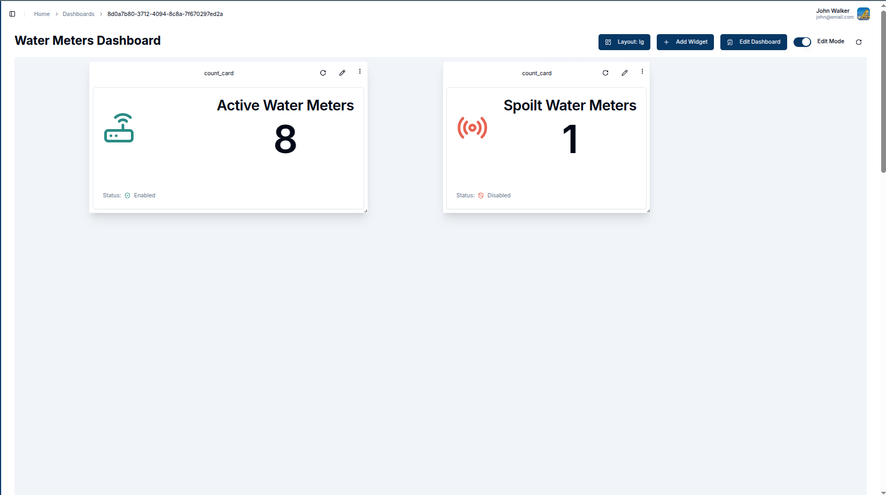
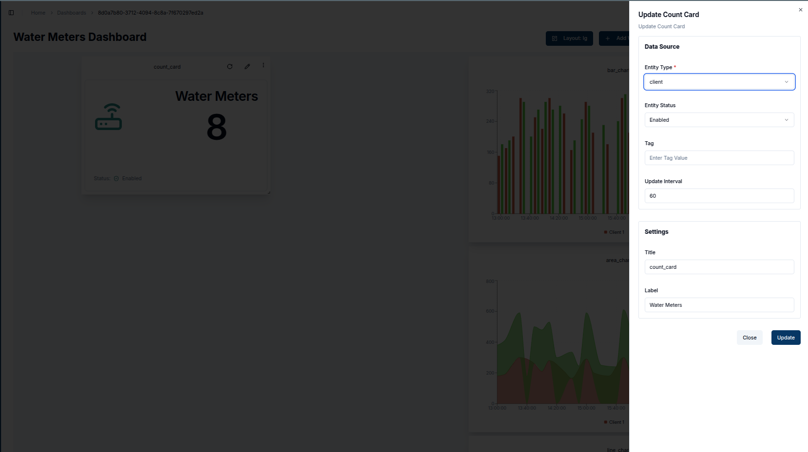

A **Count Card** displays the total number of entities (such as devices, channels, members, or groups) within a domain.
It provides a quick snapshot of how many entities are currently available, based on the selected entity type and status.

To create a Count Card, ensure your dashboard is in **Edit Mode**.
Click the **+ Add Widget** button and select **Count Card** from the list of available widgets.
This will open the **Create Count Card** dialog, where you can configure the card's data source and appearance.

#### Configuring the Count Card

1. **Entity Type**: Select the type of entity you wish to count in the card. The available options include:
   - **Thing** (device)
   - **Channel**
   - **Member**
   - **Group**

2. **Entity Status**: Choose whether to count only enabled entities, disabled entities, or both.
3. **Tag**: Optionally, you can filter the entities shown by specifying a tag. Only entities with the given tag will be counted.
4. **Update Interval**: Set the interval for how often the card should refresh to show the latest count. For example, an interval of `60` seconds will refresh the card every minute.
5. **Title**: Provide a title for your count card. This will be displayed at the top of the widget.

Once all the necessary fields are completed, click the **Create** button to add the Count Card to your dashboard.

The card will immediately display the total count of entities based on the selected data source and filters. The card will also display:

- **Status**: Whether the entities counted are enabled or disabled.
- **Tag**: If you specified a tag, it will display the tag value.

   

You can edit a Count Card by clicking the **Pencil Icon** in the top-right corner of the widget. This will open a sheet on the right, allowing you to adjust the data source, entity status, tag, and other settings.

#### Editing the Count Card

1. **Data Source**: Modify the **Entity Type**, **Status**, or **Tag** to change the entities being counted.
2. **Update Interval**: Adjust how often the card should refresh with the latest count.
3. **Title**: Update the title of the count card to reflect any new data or focus.

  

Once the updates are made, click **Update** to save the changes. The count card will refresh with the new data and settings.

  

#### Customizing Count Cards

Count Cards are versatile and can be customized to suit your needs. You can easily change the title, status, tags, and icons displayed on the card. The image below highlights the key customizable features:

   

1. **Changing Icons**: Each entity type can have its own icon, visually representing the type of entity being counted (e.g., a device icon for "Things").
2. **Entity Status**: Displays the status (Enabled/Disabled) of the entities.
3. **Deleting a Card**: You can delete a count card by clicking the **Trash Icon**. This will bring a popup asking for confirmation.
4. **Popup**: Click `Delete` to confirm that you'd like to delete the chart.
5. **Titles**: Shows the title of the count card, which can be customized for clarity.

With Count Cards, you can effectively monitor the total number of devices, channels, members, or groups in your domain, making them ideal for quick overviews of critical metrics.
