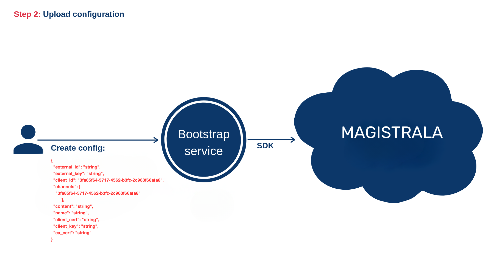
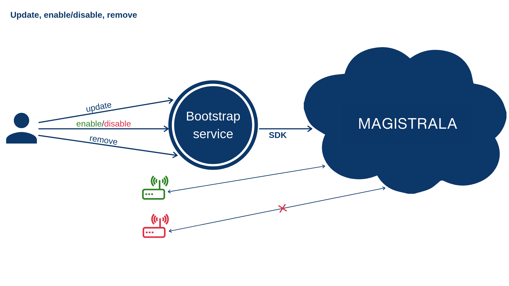

**Bootstrapping** refers to a self-starting process that is supposed to proceed without external input. Magistrala platform supports bootstrapping process, but some of the preconditions need to be fulfilled in advance. The device can trigger a bootstrap when:

- device contains only bootstrap credentials and no Magistrala credentials
- device, for any reason, fails to start a communication with the configured Magistrala services (server not responding, authentication failure, etc..).
- device, for any reason, wants to update its configuration

> ⚠️ **Note:** Bootstrapping and provisioning are distinct.
>
> - **Provisioning** manages entities (like devices and channels).  
> - **Bootstrapping** manages device configuration.

## Bootstrapping Workflow


_1) Configure device with Bootstrap service URL, an external key and external ID_

> 
>
> _Optionally create Magistrala channels if they don't exist_
>
> 
>
> _Optionally create Magistrala client if it doesn't exist_


_2) Upload configuration for the Magistrala client_


_3) Bootstrap - send a request for the configuration_


_4) Connect/disconnect client from channels, update or remove configuration_

## Configuration Structure

A Magistrala client’s configuration includes:

- **Channels:** List of Magistrala channels the client connects to.
- **Custom Content:** Device-specific configuration parameters (optional).
- **Credentials:** Client secret, certificates (optional), and external authentication details.

Also, the configuration contains an external ID and external key, which will be explained later.
In order to enable the client to start bootstrapping process, the user needs to upload a valid configuration for that specific client. This can be done using the following HTTP request:

```bash
curl -s -S -i -X POST -H "Authorization: Bearer <user_token>" -H "Content-Type: application/json" http://localhost:9013/<domain_id>/clients/configs -d '{
  "external_id": "string",
  "external_key": "string",
  "client_id": "3fa85f64-5717-4562-b3fc-2c963f66afa6",
  "channels": [
    "3fa85f64-5717-4562-b3fc-2c963f66afa6"
  ],
  "content": "string",
  "name": "string",
  "client_cert": "string",
  "client_key": "string",
  "ca_cert": "string"
}'
```

In this example, `channels` field represents the list of Magistrala channel IDs the client is connected to. These channels need to be provisioned before the configuration is uploaded. Field `content` represents custom configuration. This custom configuration contains parameters that can be used to set up the client. It can also be empty if no additional set up is needed. The `client_secret` is the client's password.
Field `name` is human readable name and `client_id` is an ID of the Magistrala client. This field is not required. If `client_id` is empty, corresponding Magistrala client will be created implicitly and its ID will be sent as a part of `Location` header of the response. Fields `client_cert`, `client_key` and `ca_cert` represent PEM or base64-encoded DER client certificate, client certificate key and trusted CA, respectively.

There are two more fields: `external_id` and `external_key`. External ID represents an ID of the device that corresponds to the given client. For example, this can be a MAC address or the serial number of the device. The external key represents the device key. This is the secret key that's safely stored on the device and it is used to authorize the client during the bootstrapping process. Please note that external ID and external key and Magistrala ID and Magistrala key are _completely different concepts_. External id and key are only used to authenticate a device that corresponds to the specific Magistrala client during the bootstrapping procedure. As Configuration optionally contains client certificate and issuing CA, it's possible that device is not able to establish TLS encrypted communication with Magistrala before bootstrapping. For that purpose, Bootstrap service exposes endpoint used for secure bootstrapping which can be used regardless of protocol (HTTP or HTTPS). Both device and Bootstrap service use a secret key to encrypt the content. Encryption is done as follows:

1. Device uses the secret encryption key to encrypt the value of that exact external key
2. Device sends a bootstrap request using the value from 1 as an Authorization header
3. Bootstrap service fetches config by its external ID
4. Bootstrap service uses the secret encryption key to decrypt Authorization header
5. Bootstrap service compares value from 4 with the external key of the config from 3 and proceeds to 6 if they're equal
6. Bootstrap service uses the secret encryption key to encrypt the content of the bootstrap response

> Please bear in mind that secret key is passed to the Bootstrap service as an environment variable. As security measurement, Bootstrap service removes this variable once it reads it on startup. However, depending on your deployment, this variable can still be visible as a part of your configuration or terminal emulator environment.

For more details on which encryption mechanisms are used, please take a look at the implementation.

### Bootstrapping

Currently, the bootstrapping procedure is executed over the HTTP protocol. Bootstrapping is nothing else but fetching and applying the configuration that corresponds to the given Magistrala client. In order to fetch the configuration, _the client_ needs to send a bootstrapping request:

```bash
curl -s -S -i -H "Authorization: Client <external_key>" http://localhost:9013/clients/bootstrap/<external_id>
```

The response body should look something like:

```json
{
  "client_id": "3fa85f64-5717-4562-b3fc-2c963f66afa6",
  "client_key": "3fa85f64-5717-4562-b3fc-2c963f66afa6",
  "channels": [
    "string"
  ],
  "content": "string",
  "client_cert": "string"
}
```

The response consists of an ID and key of the Magistrala client, the list of channels and custom configuration (`content` field). The list of channels contains not just channel IDs, but the additional Magistrala channel data (`name` and `metadata` fields), as well.

### Enabling and disabling clients

Uploading configuration does not automatically connect client to the given list of channels. In order to connect the client to the channels, user needs to send the following HTTP request:

```bash
curl -s -S -i -X PUT -H "Authorization: Bearer <user_token>" -H "Content-Type: application/json" http://localhost:9013/<domain-id>/clients/state/<client_id> -d '{"state": 1}'
```

In order to disconnect, the same request should be sent with the value of `state` set to 0.

### Using curl request for secure bootstrap configuration

- _Encrypt the external key._

First, encrypt the external key of your client using AES encryption. The encryption key is specified by the `MG_BOOTSTRAP_ENCRYPT_KEY` environment variable. Use a library or utility that supports AES encryption to do this. Here's an example of how to encrypt using Go:

```go
package main

import (
 "crypto/aes"
 "crypto/cipher"
 "crypto/rand"
 "fmt"
 "io"
)

type reader struct {
 encKey []byte
}

func (r reader) encrypt(in []byte) ([]byte, error) {
 block, err := aes.NewCipher(r.encKey)
 if err != nil {
  return nil, err
 }
 ciphertext := make([]byte, aes.BlockSize+len(in))
 iv := ciphertext[:aes.BlockSize]
 if _, err := io.ReadFull(rand.Reader, iv); err != nil {
  return nil, err
 }
 stream := cipher.NewCFBEncrypter(block, iv)
 stream.XORKeyStream(ciphertext[aes.BlockSize:], in)
 return ciphertext, nil
}

func main() {
 data := []byte("<external_key>")

 r := reader{
  encKey: []byte("<crypto_key>"),
 }

 encryptedData, err := r.encrypt(data)
 if err != nil {
  fmt.Println("Error encrypting data:", err)
  return
 }

 fmt.Printf("%x\n", encryptedData)
}
```

Replace `<external_key>` and `<crypto_key>` with the client's external key and `SMQ_BOOTSTRAP_ENCRYPT_KEY` respectively.

- _Make a request to the bootstrap service._

Once the key is encrypted, make a request to the Bootstrap service. Here's how to do this using `curl`:

```bash
curl --location 'http://localhost:9013/clients/bootstrap/secure/<external_id>' \
--header 'Accept: application/json' \
--header 'authorization: Client <encyrpted_external_key>' --output -
```

The response from the Bootstrap service will be in encrypted binary format. Store this response in a file for later use.

```bash
curl --location 'http://localhost:9013/clients/bootstrap/secure/<external_id>' \
--header 'Accept: application/json' \
--header 'authorization: Client <encyrpted_external_key>' --output ~/<desired\>/<path\>/<file_name.txt>
```

- _Decrypt the response_

Finally, decrypt the response using a function. Here's an example of how to do this using Go:

```go
package main

import (
 "crypto/aes"
 "crypto/cipher"
 "log"
 "os"
)

func main() {
 encodedData, err := os.ReadFile("~/<desired\>/<path\>/<enc_file_name.txt>")
 if err != nil {
  log.Fatal(err)
 }

 key := []byte("<crypto_key>")

 block, err := aes.NewCipher(key)
 if err != nil {
  log.Fatal(err)
 }

 if len(encodedData) < aes.BlockSize {
  log.Fatal("ciphertext too short")
 }

 iv := encodedData[:aes.BlockSize]
 encodedData = encodedData[aes.BlockSize:]
 stream := cipher.NewCFBDecrypter(block, iv)
 stream.XORKeyStream(encodedData, encodedData)

 err = os.WriteFile("~/<desired\>/<path\>/<decry_file_name.txt>", encodedData, 0644)
 if err != nil {
  log.Fatal(err)
 }
}
```

### Using Magistrala CLI for secure bootstrap configuration

To use Magistrala CLI for the secure bootstrap configuration, use the following command:

```bash
magistrala-cli bootstrap secure <external_id> <external_key> <crypto_key>
```

for example

```bash
magistrala-cli bootstrap bootstrap secure '09:6:0:sb:sa' 'key' 'v7aT0HGxJxt2gULzr3RHwf4WIf6DusPp'
```

For more information about the Bootstrap service API, please check out the [API documentation][api-docs].

> This feature is currently under development :hammer:

[api-docs]: https://github.com/absmach/magistrala/blob/main/api/openapi/bootstrap.yml
