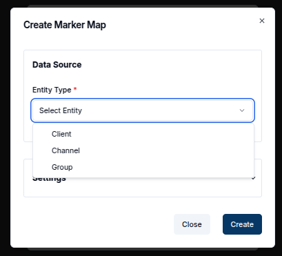
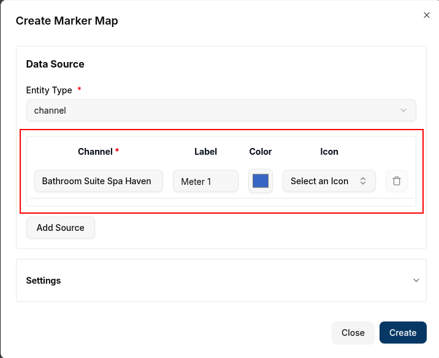
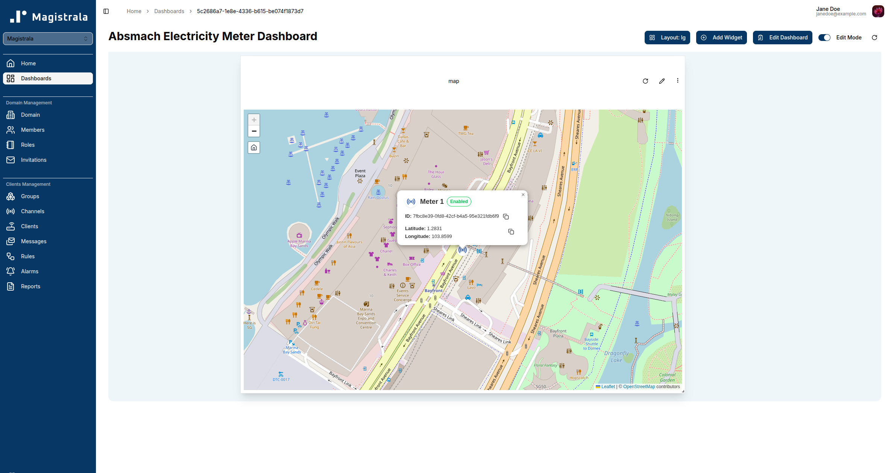
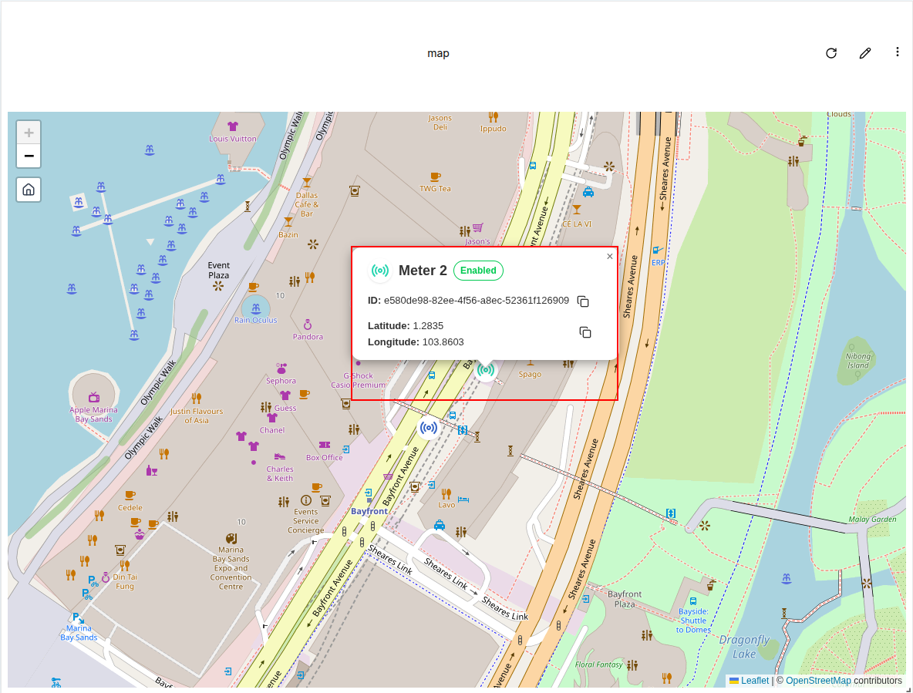
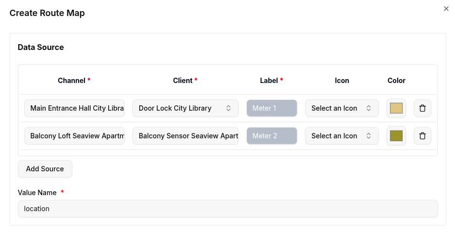
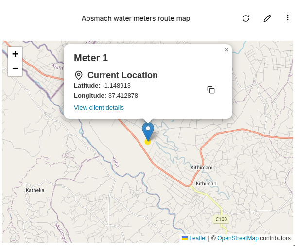
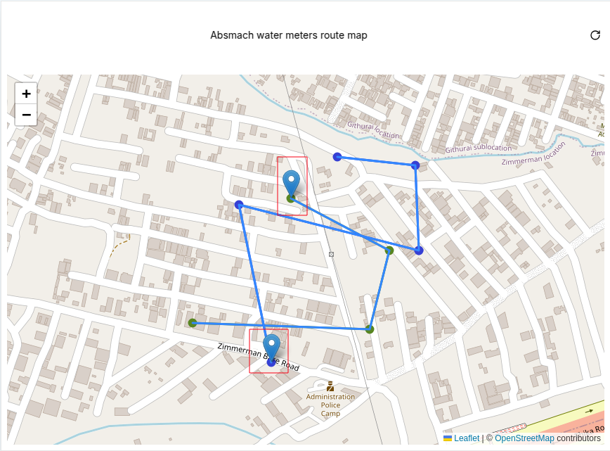

## **Marker Map**

**Marker Maps** are used to visualize the location of entities (such as devices or channels) on a map.
This makes Marker Maps useful for tracking the geographical locations of various IoT assets on a visual interface.

Marker Maps work by fetching latitude and longitude data from the entity metadata.
A typical metadata entry for an entity’s location might look like this:

```json
{
  "location": {
    "latitude": 27.181212503119802,
    "longitude": 78.04195101133526
  }
}
```

These coordinates are then used to place a marker on the map. Users can add multiple data sources, such as different devices or channels, and visualize them on the same map.

### Create a Marker Map

To create a Marker Map, ensure the dashboard is in **Edit Mode**.
Click the **+ Add Widget** button, then select **Marker Map** from the list of available widgets.

This will open the **Create Marker Map** dialog, where you can configure the data sources and appearance of the map.


### Configure the Marker Map

1. **Entity Type**: Choose the type of entity whose location data you want to visualize. Available options include:
   - **Thing** (device)
   - **Channel**
   - **Group**

   

2. **Channel**: Select the specific entity whose location data will be displayed. Since we have worked with things/ devices a lot of times, we shall plot a channel this time. This channel already has its metadata configured.
3. **Label**: Provide a label for the marker, which will help identify it on the map.
4. **Color**: Choose a color for the marker to distinguish it from other markers.
5. **Add Source**: You can add multiple data sources (entities) to the map by clicking **Add Source**.
6. **Delete Source**: You can delete a Data Source by clicking on the `Trash Icon` next to the Data Source.

   

**Settings Section**
6. **Title**: Set a title for the map (e.g., "Marker Map"). This title will appear at the top of the map.
7. **Latitude Key**: Specify the metadata key that contains the latitude value. By default, it is set to `latitude`, but you can modify it if your metadata uses a different key.
8. **Longitude Key**: Similarly, set the metadata key for the longitude. The default value is `longitude`.

  

Once all required fields are completed, click the **Create** button to add the Marker Map to your dashboard.

After creating the Marker Map, it will automatically center on the specified locations based on the metadata.



Each marker on the map has an interactive popup that provides more information about the entity.
Clicking on a marker will open a popup with the entity details, as shown below:

- **Entity Name**: This is the name of the device or channel or group with a small icon dependent on the entity type.
- **Status**: This shows the state of the entity which can be **enabled/disabled**
- **Entity ID**: This is the unique identifier for the entity. It can also be copied onto a clipboard when yo click on the copy icon next to it.
- **Latitude and Longitude**: The exact coordinates of the entity’s location, which can be copied to the clipboard.

   

### Edit a Marker Map

You can edit the Marker Map by clicking the **Pencil Icon** at the top-right corner of the map widget. This will open the **Update Marker Map** dialog, allowing you to adjust the data sources, labels, colors, and other settings.

1. **Add or Delete Data Sources**: Add additional entities to the map or remove existing ones by clicking the **Add Source** or **Trash Icon**, respectively.
2. **Modify Settings**: You can update the **Latitude Key**, **Longitude Key**, and **Title** to better reflect the data being displayed.

   

Once you've made your changes, click **Update** to apply the modifications. The updated map will display the new locations or modified settings.

   

#### Conclusion

Marker Maps provide an intuitive way to visualize the physical locations of your IoT devices or channels on a dashboard.
The flexibility to add multiple data sources, customize markers, and retrieve position data from metadata or messages ensures that this widget is highly adaptable to various use cases.
By integrating real-time location data, Marker Maps enable users to track and monitor their assets effectively.

## **Route Map**

**Route Maps** display the path or movement of a device or entity based on the location messages sent over time.
Unlike Marker Maps, which rely on metadata, Route Maps depend on message data from a connected channel-thing pair.
The messages contain latitude and longitude values that are used to trace the route on the map.
This feature is particularly useful for tracking the movement of devices over time.

### How Route Maps Work

Route Maps visualize location data by retrieving it from messages sent through a channel.
We already went through sending messages in [getting-started](getting-started.md).
Navigate to the messages tab of a channel which already has connected things.
For RouteMap it is crucial to  use `location` as the Value name. Ensure the Value type is **`string`**.
The message should have the location data in the following format (as a string):

`{"latitude":-1.206367, "longitude":36.905012}`

  

These location values will be used to plot the device's movement on the map.
The latest message will indicate the current location, and previous messages will form the route path.

### Creating a Route Map

To create a Route Map, ensure the dashboard is in **Edit Mode**. Click the **+ Add Widget** button and select **Route Map** from the list of available widgets.

This will open the **Create Route Map** dialog, where you can configure the data sources and appearance of the map.

  

### Configuring the Route Map

1. **Value Name**: Enter the name of the value that will contain the location data. This name should match the key in the message where the location information is stored.
2. **Channel**: Select the channel that will provide the location messages.
3. **Thing**: Choose the connected device (thing) associated with the selected channel.
4. **Label**: Provide a label for the route, which will help identify it on the map.
5. **Color**: Choose a color to represent the route line on the map.
6. **Add Source**: You can add multiple data sources (things or channels) by clicking **Add Source**.
7. **Remove Source**: To remove a data source, click the **Trash Icon** next to the specific entry.

  

### Settings Section

1. **Time Window**: In the advanced settings, you can define a time range (`From Date` and `To Date`). This setting will limit the messages displayed on the map to a specific time interval. The route will display all the messages sent within this window, with the pointer indicating the last message before the `To Date` timestamp.

2. **Update Interval**: Set how frequently the map should refresh to display new messages.

3. **Title**: Set a title for the map (e.g., "Device Route"). This title will appear at the top of the map.

4. **Latitude Key**: Specify the key in the message that contains the latitude value. By default, this is set to `latitude`, but you can modify it if your message uses a different key.

5. **Longitude Key**: Specify the key in the message that contains the longitude value. The default is `longitude`, but this can be changed as needed.

6. **Route Line Width**: Adjust the thickness of the route line on the map. This allows you to highlight routes or distinguish between different paths visually.

   

Once all required fields are completed, click the **Create** button to add the Route Map to your dashboard.

### Created Route Map

After creating the Route Map, it will display the path based on the messages that were sent, with the latest message showing the current location.
The map will automatically focus on the area covered by the route.

- **Single Message Route**: If only one message has been sent, the map will show a single marker for the location.
  
   

- **Multiple Messages Route**: With more messages, the route will appear longer, showing the movement or changes in location over time.

### Edit a Route Map

You can edit the Route Map by clicking the **Pencil Icon** at the top-right corner of the map widget. This will open the **Update Route Map** dialog, allowing you to adjust the data sources, time window, and other settings.

1. **Add or Delete Data Sources**: Add additional channels or things to the map, or remove existing ones by clicking **Add Source** or the **Trash Icon**, respectively.
2. **Modify Settings**: Update the **Latitude Key**, **Longitude Key**, and **Title**. You can also adjust the **Update Interval** or change the **Route Line Width** to better reflect the data being displayed.

We will start by changing the thing present in the map to new device with more points on the map.

  

Once you've made your changes, click **Update** to apply the modifications.
The map will refresh with the new data or settings, and any changes to the route will be displayed.

  

You can also add new data sources and have them show up on the map as well as shown below:

  

### Route Map Popups

Each point on the map representing a message has an interactive popup with more details about the entity. The popup includes:

- **Label**: The label assigned to the route.
- **Current Location**: Displays the current location based on the latest message.
- **Latitude and Longitude**: The exact coordinates of the location, which can be copied to the clipboard.
- **View Thing Details**: A link to the specific entity's details page.

  

#### Summary

Route Maps provide a dynamic way to visualize the movement or changes in location of your devices over time.
By retrieving location data from messages, these maps enable real-time tracking and historical path analysis.
With customizable settings such as update intervals and time windows, Route Maps offer flexibility in monitoring IoT devices' geographical movements.
Users can track multiple devices, review their routes, and access detailed information via interactive popups, making Route Maps an essential tool for IoT asset management.
