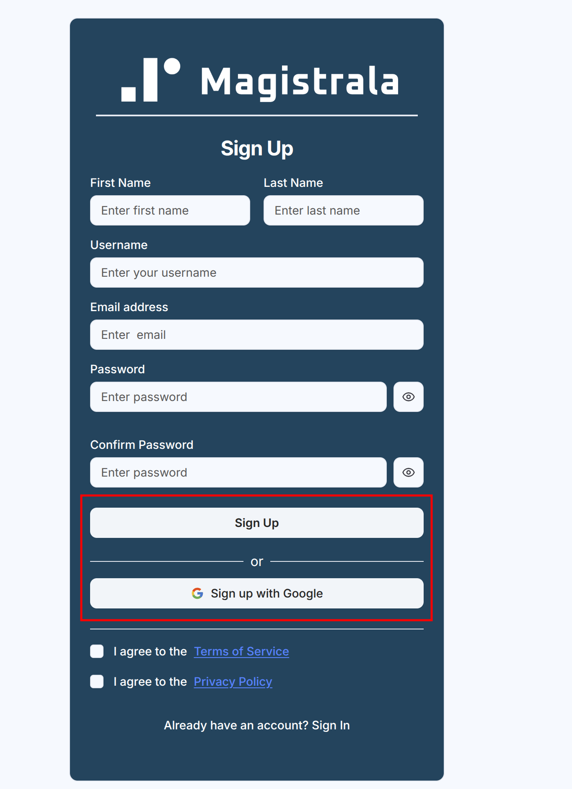
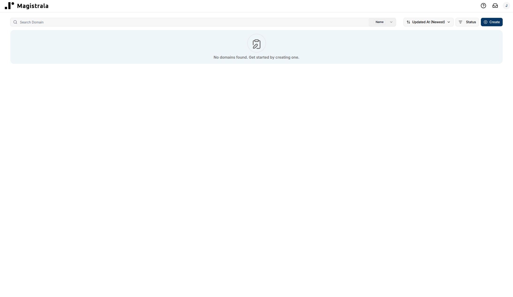
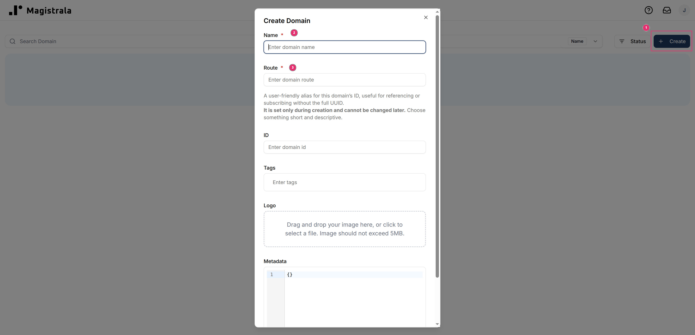
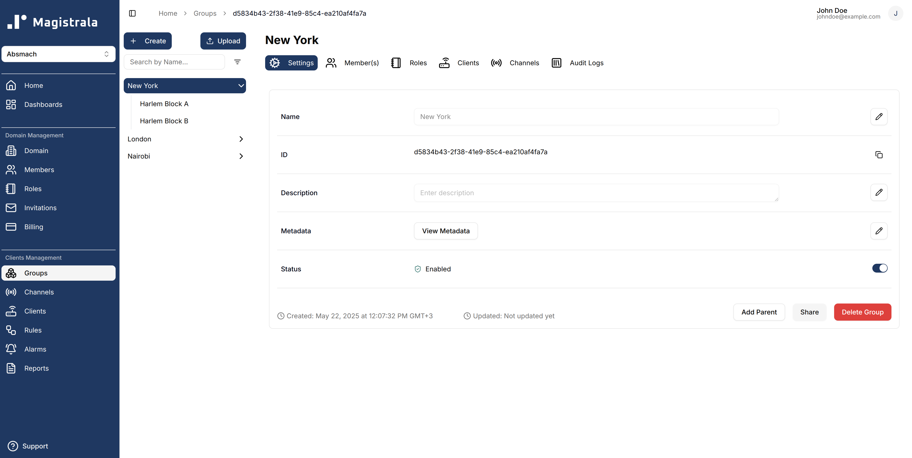
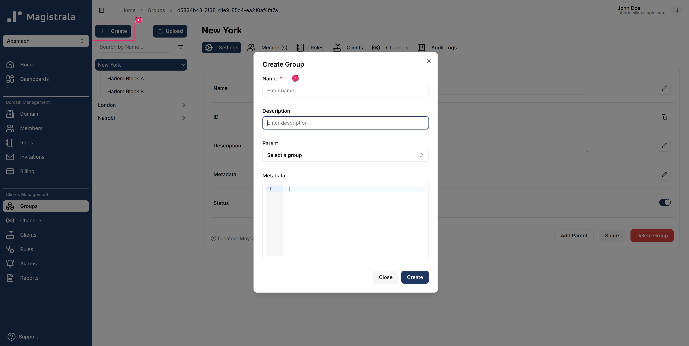
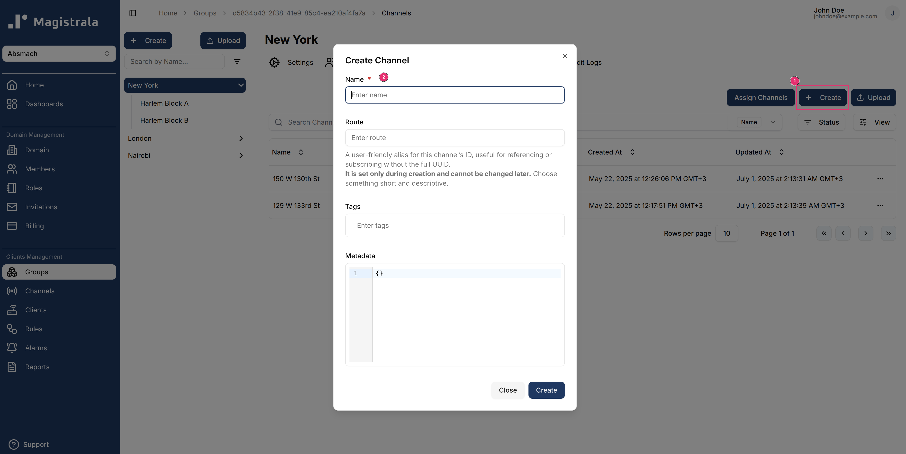
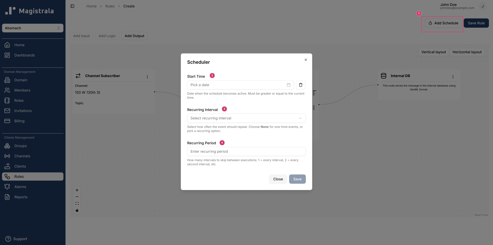

Magistrala leverages **SuperMQ** as the backbone for its **Services**, handling the creation, deletion, updating, and retrieval of user accounts, clients and channels.
Users in Magistrala must have **unique credentials**, including a `username`, `secret`, and `email` address upon creation.

This guide will take you through the core services for a quick setup of Magistrala and a walkthrough of its services and components.

## Sign Up

To get started, create an account by providing the following details in the Sign Up page:

- **First and last name**
- **An email address**
- **A username**



> **NB:** Please review and accept our Terms of Service and Privacy Policy to proceed with registration.

Once registered, the user will be redirected to the **Domains Homepage**, where they can create and manage multiple domains.



## Log In

In case you already have an account, you can log in with your email/username and password.


## Log into a Domain

Upon logging in, users are redirected to the **Domain Selection Page**.

A **Domain** is a workspace that allows you to manage **Clients**, **Channels**, **Groups**, **Dashboards**, **Members**,  **Rules**  and **Bootstrap** services. A user can create as many domains as they please.

Click the `+ Create` button in the top-right corner to start. In addition to the domain name, you’ll need to set a **route**, a unique, user-friendly alias for the domain’s ID. This route makes it easier to reference or subscribe to the domain without using its full UUID.  
**The route is defined only at creation and cannot be changed later, so choose something short, clear, and descriptive.**  



Once you create a domain, you are given **admin** role over the domain by default. You are able to perform all actions available over the domain and all the entities provisioned inside the domain. You can also assign or invite members to the domain with various levels of permissions. Click on the respective card to log into a domain of your choice.

We will delve deeper into Domains in [another section](./domain-management/domain.md). For now you need to be able to log into a Domain to move on to **Groups**.

## Create a Group

Once logged in, you will be directed to the **Homepage** where you can view all the available entities in the domain.

On the sidebar navigation, click on **Groups** under the _Clients Management_ section to be redirected to the groups page.



To create a group, click on the `+ Create` button present on the top-left corner of the page. This will open a popover with all the required fields for a new group.



## Create a Client

A **Client** represents a device connected to Magistrala, capable of communication with other devices.
It can be a **physical** or **virtual** device that sends and receives messages, often through **embedded systems**.

When you create a client within a specific group, it is automatically assigned to that group and can be connected to **any channel in the domain**.

To create a new client, go to the **Clients** page of the desired group and click the `+ Create` button.  
A dialog will appear asking for details such as:

- **Name** (required)  
- **Key** (optional) - The client key is used to authorize the device to send messages. If left blank, a key is auto-generated during client creation. Users may also provide their own key, and it can be edited later.  
- **Tags** (optional, for organization and filtering)  

Adding tags can help you quickly locate and manage clients in larger setups.


A user can also create bulk clients by clicking on the `Upload` button. This will lead to a dialog box that takes in a _.CSV_  file with the client's details filled in correctly as seen in these [samples](https://github.com/absmach/magistrala-ui/tree/main/samples).

The file should have the following fields in order:

1. Name (Required)
2. Metadata
3. Tags


### View a Client

Once created, a **group-client** can be viewed and updated in the unique Client's ID page.
To open this page, click on the desired client in the **Clients** table.

From the Client Details page, you can:

- Update the client’s information  
- Copy its **ID** and **secret**  
- Manage its connections
- Manage the Client's **Roles** as well as **Members**
- View the Client's audit logs


The **Connections** tab in the **group-client page** is where a User can connect a Client to a Channel.

## Create a Channel

Channels act as **message conduits**, enabling communication between clients.

They serve as topics that multiple clients can **publish** to or **subscribe** from, allowing seamless device-to-device messaging.  
While subtopics are supported for more granular message routing, they are optional for basic interactions.

Each channel has a **route**, which is a user-friendly alias for the channel’s ID.  
The route makes it easier to reference or subscribe to the channel without needing the full UUID.  
It is defined **only during creation** and cannot be changed later, so choose something short, clear, and descriptive.

To create a channel, navigate to the fourth tab under the groups and click on `+ Create`. This will open a dialog box which will take in a unique Channel name. Much like the Clients, clicking on `Upload` will allow a user to upload a _.CSV_ file with multiple channels.



### View a Channel

After the Channel is created, clicking on it while it is on the Channels table leads to the Channel View Page.


Clients can be connected to channels in groups. This is done in the **Connections** tab. There are two connection types:

- **Subscribe**
- **Publish**


## Create a Rule

To store any messages in the Magistrala database, you must first create and save a **Rule** using **Rules Engine**.  

Navigate to the **Rules Engine** section on the navigation bar and click on `+ Create`.
You will be taken directly to the **Rule Creation** page, where you can start building your rule by adding the required nodes.


---

### Building the Rule

1. **Add Input Node**  
   - Click **Add Input** and choose **Channel Subscriber**.  
   - Select the channel you want to subscribe to from the list.  
   - (Optional) Add a **topic** for more specific filtering.  
   - The input node will now appear on the canvas.

2. **Add Logic Node**  
   - Click **Add Logic** and choose **Lua Script Editor**.  
   - There is a default **logicFunction** that can return the SenML payload of incoming messages or you can enter your own rule logic, for example:  

>```lua
>function logicFunction()
>  return message.payload
>end
>```

3. **Add Output Node**
    - Click **Add Output** and choose **Internal DB** to store messages in the Magistrala Postgres database.

4. **(Optional) Add Schedule**
    - Click **Add Schedule** to open the scheduler dialog.
    - Set the **Start Time**, **Recurring Interval**, and **Recurring Period** as needed.

  

### Save a Rule

Once you have added all required nodes (**Input**, **Logic**, and **Output**), click **Save Rule**.  
A dialog will appear where you can enter the **Rule Name** and optional **Tags**.  
Click **Create** to save the rule.


Your new rule will now appear in the Rules table, ready to process incoming messages.

> More information about Rules Creation and Updating can be found in the [Rules Engine Section](./rules-engine.md)

## Send a Message

Once a Channel and Client are connected as well as Rule created, a user is able to send messages. Navigate to the `Messages` tab of the Group-Channel and click on `Send Messages`.


This will open a dialog box where all the required fields bear an asterisk. Messages are sent via _HTTP_ protocol in the UI.


Users can also send messages using curl commands for HTTP or via MQTT.  
Here are some examples:

**Using HTTP**:

```bash
curl -s -S -i --cacert docker/ssl/certs/ca.crt -X POST -H "Content-Type: application/senml+json" -H "Authorization: Client <client_secret>" https://localhost/http/m/<domain_id>/c/<channel_id> -d '[{"bn":"some-base-name:","bt":1.276020076001e+09, "bu":"A","bver":5, "n":"voltage","u":"V","v":120.1}, {"n":"current","t":-5,"v":1.2}, {"n":"current","t":-4,"v":1.3}]'
```

**Using MQTT**:

```bash
mosquitto_pub -I <client_name> -u <client_id> -P <client_secret> -t m/<domain_id>/c/<channel_id> -h localhost -m '[{"bn":"some-base-name:","bt":1.276020076001e+09, "bu":"A","bver":5, "n":"voltage","u":"V","v":120.1}, {"n":"current","t":-5,"v":1.2}, {"n":"current","t":-4,"v":1.3}]'
```  

:::info

More information on how to send messages via the terminal can be found in the **Developer Docs**, under the [**Messaging section** in **Developer Tools**](/docs/dev-guide/messaging.md).

:::

The messages table will then update to include the message sent with the latest message appearing first.
Using the filter options, you can filter through a wide range of messages based on the protocol, publisher or even value.


Some advanced filters allow the user to filter based on the required value type, such as boolean or string values.
The time filter allows the user to select a date and define a specific time window using the date-time picker.
The user can also find aggregate values of messages provided they add an interval as well as a `From` and `To` time.
With these values you can get the `Maximum`, `Minimum`, `Average` and `Count` value of messages within a certain time period.

The user can also download a list of messages based on selected filters and view them in a `.csv` file by clicking the `Download Messages` button at the top right of the messages table.  


Messages provide a core service for our IoT platform especially when it comes to the Dashboards service.
