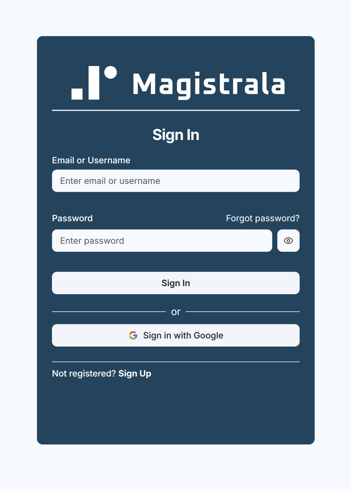
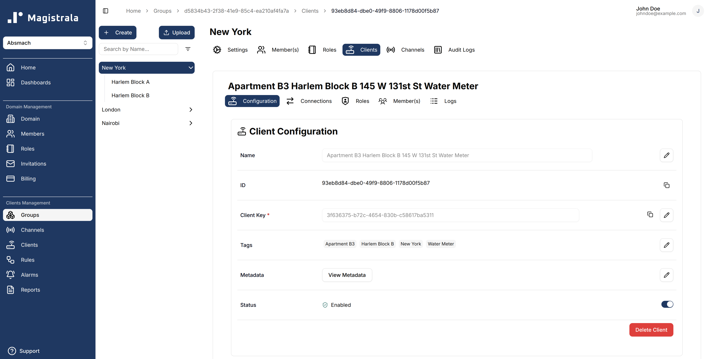
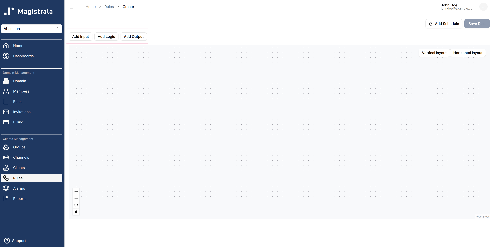
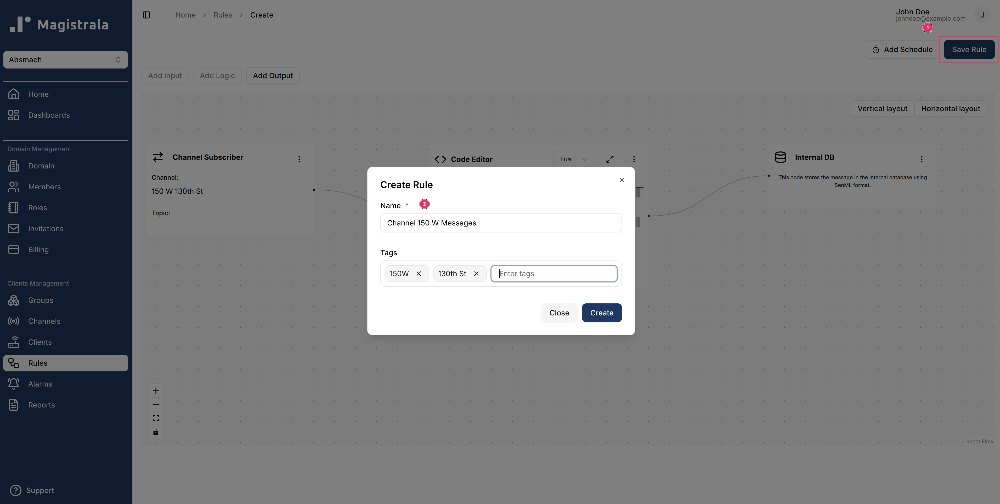
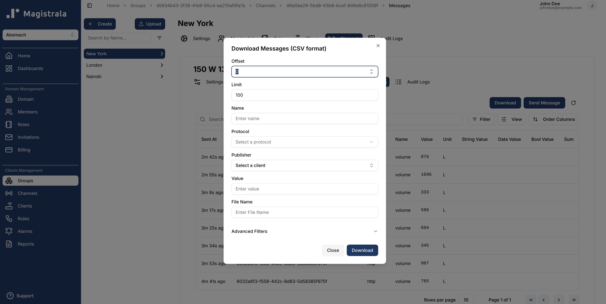

Magistrala leverages **SuperMQ** as the backbone for its **Services**, handling the creation, deletion, updating, and retrieval of user accounts, clients and channels.
Users in Magistrala must have **unique credentials**, including a `username`, `secret`, and `email` address upon creation.

This guide will take you through the core services for a quick set up of Magistrala and a walkthrough its services and components.

## Sign Up

To get started, create an account by providing the following details in the sign up page:

- **First and last name**
- **An email address**
- **A username**


Once registered, the user will be redirected to the **Domains Homepage**, where they can create and manage multiple domains.


## Log In

Incase you already have an account, you can log in with your email/username and password.



## Log into a Domain

Upon logging in, users are redirected to the **Domain Selection Page**.

A **Domain** is a workspace that allows you to manage **Clients**, **Channels**, **Groups**, **Dashboards**, **Members**,  **Rules**  and **Bootstrap** services. A user can create as many domains as they please.

Click on the `+ Create` button on the top right to create a new domain. Since multiple domains can have the same name, you must add an **alias** which will be a unique descriptor for the domain.


Once you create a domain, you are given **admin** role over the domain by default. You are able to perform all actions available over the domain and all the entities provisioned inside the domain. You can also assign or invite members to the domain with various levels of permissions. Click on the respective card to log into a domain of your choice.

We will delve deeper into Domains in another section. For now you need to be able to log into a Domain to move on to **Groups**.

## Create a Group

Once logged in, you will be directed to the **Homepage** where you can view all the available entities in the domain.

On the sidebar navigation, click on **Groups** under the _Client Management_ section to be redirected to the groups page.


To create a group, click on the `+ Create` button present on the top-left corner of the page. This will open a popover with all the required fields for a new group.


## Create a Client

A **Client** represents a device connected to Magistrala, capable of communication with other devices.

They are physical or virtual devices that can send and receive messages through **embedded systems**.

Any Client created while in the group can be connected to any channel within the group.

A **new client** can be created by navigating to the **Clients Page** section of the Group and clicking the `+ Create Client` button.
A dialog box will open, requiring fields such as **Name**.
You can add a unique key for the client, although one is automatically generated.
Additionally, **tags** can be assigned to clients for better organization and filtering.


A user can also create bulk clients by clicking on the `+ Create Clients` button. This will lead to a dialogbox that takes in a _.CSV_  file with the clients' details filled in correctly as seen in these [samples](https://github.com/absmach/magistrala-ui/tree/main/samples).

The file should have the following fields in order:

1. Name (Required)
2. Metadata
3. Tags


### View a Client

Once created, a **group-client** can be viewed and updated in the unique Client's ID page.
To access the page, click on the Client in the Clients' table.

The client's data can be updated in this page and its ID and secret copied as well.



There **Connections** tab in the **group-client page** is where a User can connect a Client to a Channel.

## Create a Channel

Channels are considered as message conduits.

They are responsible for the messages exchange between Clients and act as message topic that can be be **published** or **subscribed** to by multiple Clients.

Each Client can **publish or subscribe** to a Channel, facilitating seamless device-to-device communication. Although subtopics can exist, they are not required for basic interactions.

To create a channel, navigate to the fourth tab under the groups and click on `+ Create`. This will open a dialog box which will take in a unique Channel name. Much like the Clients, clicking on `+ Create Channels` will allow a user to upload a _.CSV_ file with multiple channels.


### View a Channel

After the Channel is created, clicking on it while it is on the Channel's table leads to the Channel View Page.


Clients can be connected to channels in groups. This is done in the **Connections** tab. There are two connection types:

- **Subscribe**
- **Publish**


## Create a Rule

To be able to save any messages to our Magistrala database, a rule must be created and saved.
Rules Engine takes care of this procedure.
Navigate to the **Rules Engine** section on the navigation bar and click on `+ Create`.
This will open a dialog box onto which you can enter the Rule name.



Once created the Rule will show up on the table present on the page.

### Save a Rule

Click on the Rule just created to be able to view its properties.
Select the **Input Node** on the Rule page. This will bring up a dialog box which will allow you to select a **Channel Subscriber** as the input type. Then select the **channel** which will be subscribed to from the list of channels as well as the **topic** of the payload.
The Input Node will then appear on the screen.

Next, set up the input logic of your Rule. You can select the `Lua Script Editor` from the two options present.
Once the Code Editor appears ensure to add the following Lua Script that will be used to define your Rule logic.

```lua
function logicFunction()
  return message.payload
end
```

This will be able to return the SenML payload of the messsages published.

Finally select the **Internal DB** option from the **Output Node** dialog option which will store the messages in the internal Magistrala Postgres DB.



> More information about Rules Creation and Updating can be found in the [Rules Engine Section](./rules-engine.md)

## Send a Message

Once a Channel and Client are connected as well as Rule created, a user is able to send messages. Navigate to the `Messages` tab of the Group-Channel and click on `Send Messages`.


This will open a dialog box where all the required fields bear an asterisk. Messages are sent via _HTTP_ protocol in the UI.


Users can also send messages using curl commands for HTTP or via MQTT.  
Here are some examples:

**Using HTTP**:

```bash
curl -s -S -i --cacert docker/ssl/certs/ca.crt -X POST -H "Content-Type: application/senml+json" -H "Authorization: Client <client_secret>" https://localhost/http/m/<domain_id>/c/<channel_id> -d '[{"bn":"some-base-name:","bt":1.276020076001e+09, "bu":"A","bver":5, "n":"voltage","u":"V","v":120.1}, {"n":"current","t":-5,"v":1.2}, {"n":"current","t":-4,"v":1.3}]'
```

**Using MQTT**:

```bash
mosquitto_pub -u <client_id> -P <client_secret> -t m/<domain_id>/c/<channel_id> -h localhost -m '[{"bn":"some-base-name:","bt":1.276020076001e+09, "bu":"A","bver":5, "n":"voltage","u":"V","v":120.1}, {"n":"current","t":-5,"v":1.2}, {"n":"current","t":-4,"v":1.3}]'
```  

:::info

More information on how to send messages via the terminal can be found in the **Developer Docs**, under the [**Messaging section** in **Developer Tools**](/docs/dev-guide/messaging).

:::

The messages table will then update to include the message sent with the latest message appearing first.
Using the filter options, you can filter through a wide range of messages based on the protocol, publisher or even value.


Some advanced filters allow the user to filter based on the required value type, such as boolean or string values.
The time filter allows the user to select a date and define a specific time window using the date-time picker.
The user can also find aggregate values of messages provided they add an interval as well as a `From` and `To` time.
With these values you can get the `Maximum`, `Minimum`, `Average` and `Count` value of messages within a certain time period.

The user can also download a list of messages based on selected filters and view them in a `.csv` file by clicking the `Download Messages` button at the top right of the messages table.  



Messages provide a core service for our IoT platform especially when it comes to the Dashboards service.
