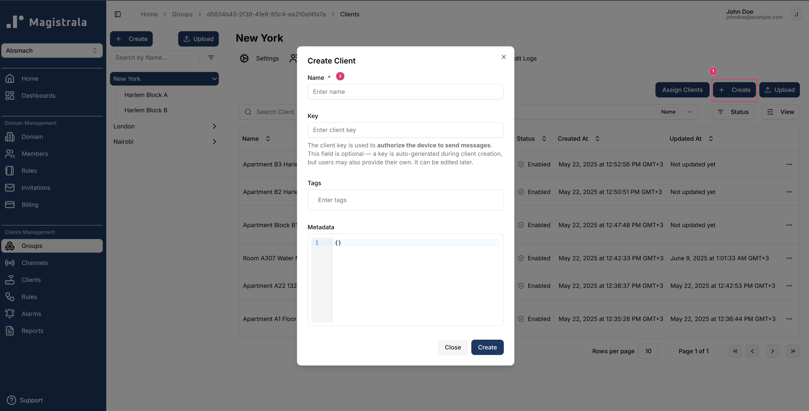
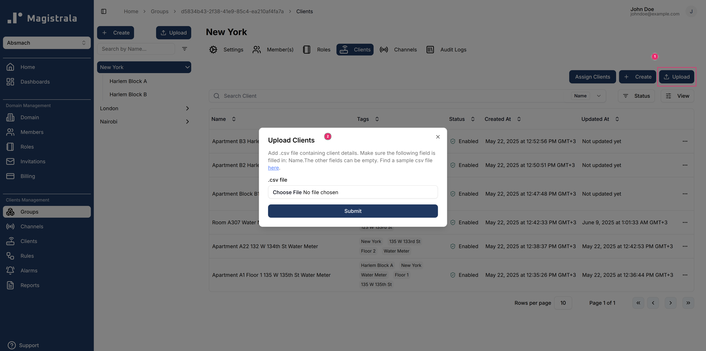
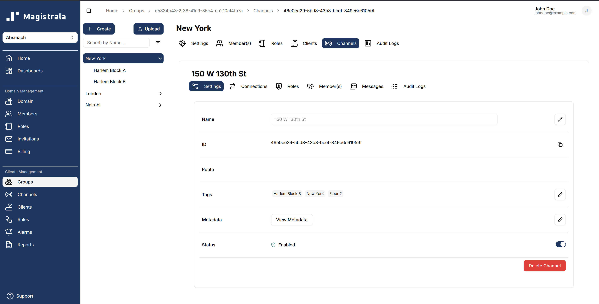

Magistrala leverages **SuperMQ** as the backbone for its **Services**, handling the creation, deletion, updating, and retrieval of user accounts, clients and channels.
Users in Magistrala must have **unique credentials**, including a `username`, `secret`, and `email` address upon creation.

This guide will take you through the core services for a quick set up of Magistrala and a walkthrough its services and components.

After cloning and launching Magistrala, head to `localhost:3000` for the Magistrala UI platform.

## **Signing Up**

To create a new user with **standard permissions**, navigate to the **Register** page. The new user must provide:

- **First and last name**
- **A unique email address**
- **A username**

Once registered, the user will receive a unique authentication token and be redirected to the **Domains Homepage**, where they can create and manage multiple domains.

Tokens tend to expire after some time which will lead to the user being kicked out of the session. Do not be alarmed if this happens. Simply back log in through the Login page with the user's **username** or **email address** as well as password.

## **Logging In**

To access the platform, log in with your email or username and password.

## **Logging into a Domain**

Upon logging in, users are redirected to the **Domain Selection Page**.

A **Domain** is a workspace that contains **Clients**, **Channels**, **Groups**, **Dashboards** as well as **Roles** and **Rules Engine** Services. A user can create as many domains as they please. A **Super Admin** has access to all domains present in the system. But a **User** must be a member or creator of a domain to log into it.

Click on the `+ Create` button on the top right to create a new domain. Since multiple domains can have the same name, you must add an **alias** which will be a unique descriptor for the domain.

Once you create a domain, you are given **Administrator** permission over the domain. You are able to perform all actions available over the domain and all the entities provisioned inside the domain. You can also assign or invite members to the domain with various levels of permissions.

We will delve deeper into Domains in another section. For now you need to be able to log into a Domain to move on to **Groups**.

## **Creating a Group**

Once logged in, you will be directed to the **Homepage** where you can view all the available entities in the domain.

On the sidebar navigation, click on **Groups** under the _Client Management_ section to be redirected to the groups page.

To create a group, click on the `+ Create` button present on the top-left corner of the page. This will open a popover with all the required fields for a new group.

There is an option to add a parent to the group. This creates a hierachy. Permissions and roles can be shared down this heirachy.

You can also create multiple groups at the same time using a _.CSV_ file which has all the required fields correctly filled in. Click on the `Upload` button and add your csv file. Magistrala provides samples as shown on the popover.

## **Creating a Client**

A **Client** represents a device connected to Magistrala, capable of communication with other devices.

They are physical or virtual devices that can send and receive messages through **embedded systems**.

Any Client created while in the group can be connected to any channel within the group.

A **new client** can be created by navigating to the **Clients Page** section of the Group and clicking the `+ Create Client` button.
A dialog box will open, requiring fields such as **Name**.
You can add a unique key for the thing, although one is automatically generated.
Additionally, **tags** can be assigned to Clients for better organization and filtering.

A user can also create bulk clients by clicking on the `+ Create Clients` button. This will lead to a dialogbox that takes in a _.CSV_  file with the clients' details filled in correctly as seen in these [samples](https://github.com/absmach/magistrala-ui/tree/main/samples).

### Viewing a Client

Once created, a **group-client** can be viewed and updated in the unique Client's ID page.
To access the page, click on the Client in the Clients' table.

The client's data can be updated in this page and its ID copied as well.

There **Connections** tab in the **group-client page** is where a User can connect a Client to a Channel.

## **Creating a Channel**

Channels are considered as message conduits.

They are responsible for the messages exchange between Clients and act as message topic that can be be **published** or **subscribed** to by multiple Clients.

Each Client can **publish or subscribe** to a Channel, facilitating seamless device-to-device communication. Although subtopics can exist, they are not required for basic interactions.

To create a channel, navigate to the fourth tab under the groups and click on `+ Create`. This will open a dialog box which will take in a unique Channel name. Much like the Clients, clicking on `+ Create Channels` will allow a user to upload a _.CSV_ file with multiple channels.

### Viewing a Channel

After the Channel is created, clicking on it while it is on the Channel's table leads to the Channel View Page.

Clients can be connected to channels in groups. This is done in the **Connections** tab. There are two connection types:

- **Subscribe**
- **Publish**

## **Messaging**

Once a Channel and Client are connected, a user is able to send messages. Navigate to the `Messages` tab of the Group-Channel and click on `**Send Messages**`.

This will open a dialog box where all the required fields bear an asterisk. Messages are sent via _HTTP_ protocol in the UI.

The messages table will then update to include the message sent with the latest message appearing first.
Using the filter options, you can filter through a wide range of messages based on the protocol, publisher or even value.

> The download message feature is currently not active but will be with future iterations of Magistrala.

Some advanced filters allow you to filter based on which type of value you require such as boolean values or string values.
There is also a provision for time where the date-time picker allows you to select a date and input a specific time window.
You can also find aggregate values of messages provided you add an interval as well as a `From` and `To` time.
With these values you can get the `Maximum`, `Minimum`, `Average` and `Count` value of messages within a certain time period.
You can also be able to download a list of messages depenidng on any of the filters you need and view them in a `.csv` file.
Messages provide a core service for our IoT platform especially when it comes to the Dashboards service.
